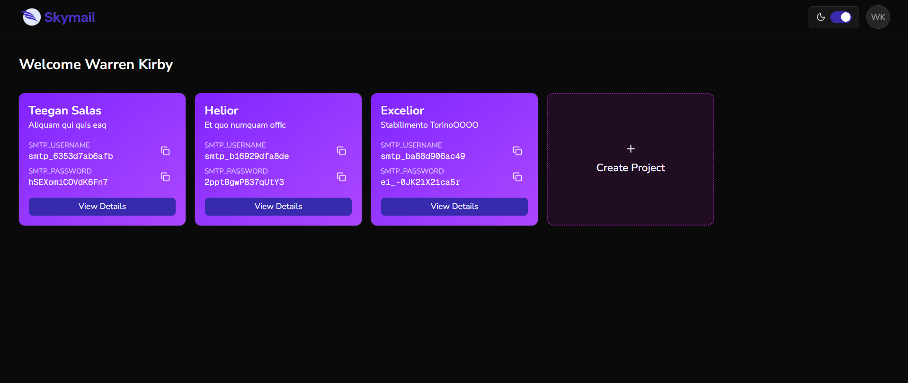
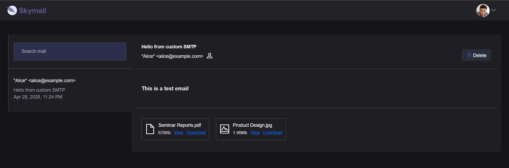

# Skymail - Developer-Friendly Mail Testing Server

**Skymail** is a lightweight, developer-friendly alternative to Mailtrap. It allows developers to create accounts, register multiple projects, and instantly get SMTP credentials to test email functionality in any application. All emails sent to your project are safely captured and viewable in the Skymail dashboard.

---

## Features

- 📨 **Multiple Projects per User**: Create and manage multiple projects from a single account.  
- 🔑 **Auto-Generated SMTP Credentials**: Each project gets a unique SMTP username and password.  
- 📬 **Email Inbox for Testing**: View emails in a clean, simple UI without sending them to real users.  
- 📄 **Attachments Supported**: Preview or download attachments in your test emails.  
- 🔍 **Search Emails**: Quickly find emails by sender, subject, or content.  
- 🖤 **Dark Mode UI**: Sleek, modern, and developer-friendly interface.  

---

## Screenshots

**Projects Dashboard**  
  

**Email Viewer**  
  

---